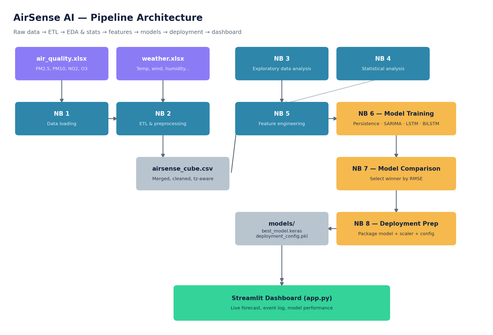
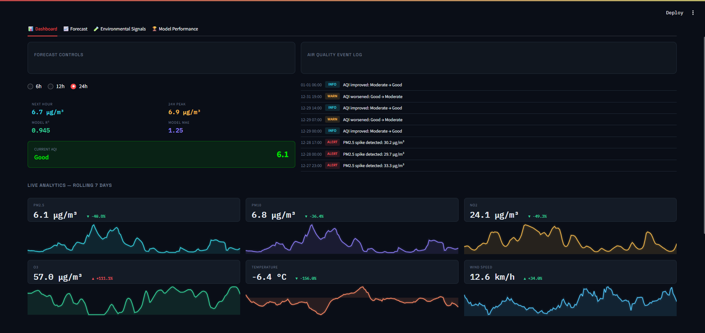

<p align="center">
  
</p>

<h1 align="center">🌫️ AirSense AI</h1>
<p align="center"><b>Intelligent Urban Air Quality Forecasting & Decision Support System — New York City</b></p>

<p align="center">
  
  
  
  
  
</p>

---

## Table of Contents

1. [Overview](#overview)
2. [Pipeline Architecture](#pipeline-architecture)
3. [Dataset & Features](#dataset--features)
4. [Pipeline — 8 Notebooks](#pipeline--8-notebooks)
5. [Results & Metrics](#results--metrics)
6. [Screenshots](#screenshots)
7. [Getting Started](#getting-started)
8. [Known Issues & Limitations](#known-issues--limitations)
9. [Roadmap](#roadmap)
10. [Author](#author)

---

## Overview

Air pollution in dense urban environments like New York City fluctuates hour to hour, driven by traffic, weather, and seasonal patterns — yet most public air quality tools only show what conditions are *right now*, not what they'll be in the hours ahead.

**AirSense AI** is an end-to-end data science pipeline that ingests two years of hourly air quality and weather data for NYC, engineers time-aware features, trains and rigorously compares four forecasting approaches (a naive baseline, a classical statistical model, and two recurrent neural networks), and serves the winning model through a live Streamlit dashboard — complete with a real-time event log, AQI-based alerts, and a 24-hour PM2.5 forecast.

**What makes this more than a template pipeline:** every notebook was built and debugged against the real dataset, not synthetic placeholder data — including catching and fixing a DST-related datetime parsing bug, an LSTM architecture flaw that was silently excluding the target's own autoregressive history, and a methodological asymmetry in how SARIMA's blind long-horizon forecast was being compared against models that get fresh data every hour.

---

## Pipeline Architecture

<p align="center">
  
</p>

Raw Excel exports (Open-Meteo API format) flow through cleaning, merging, and feature engineering, into four competing forecasting models, before the winner is packaged and served live by the dashboard.

---

## Dataset & Features

| Source | File | Columns | Coverage |
|---|---|---|---|
| Air quality | `air_quality.xlsx` | PM2.5, PM10, NO2, O3 | Hourly, Jan 2024 – Jan 2026 |
| Weather | `weather.xlsx` | Temperature, Relative Humidity, Wind Speed, Wind Direction, Precipitation, Cloud Cover | Hourly, Jan 2024 – Jan 2026 |

Both files are raw **Open-Meteo API exports** for New York City (40.7°N, 74.0°W) — hourly resolution, **17,568 rows** each, zero missing hours confirmed in Notebook 1.

**Engineered features** (built in Notebook 5, grounded in Notebook 4's statistical findings rather than arbitrary guesses):

| Feature type | Examples |
|---|---|
| PM2.5 autoregressive lags | `PM2.5(t-1)`, `PM2.5(t-3)`, `PM2.5(t-6)`, `PM2.5(t-12)`, `PM2.5(t-24)` |
| Weather lags at data-driven optimal offsets | `Wind Speed(t-3)`, `Temperature(t-6)`, `Relative Humidity(t-2)` |
| Rolling statistics | 24-hour trailing mean & std of PM2.5 |
| Calendar features | Hour, Weekday (one-hot), Month, Season (one-hot), Weekend, ISO Week |

> Note: the original project plan called for a Surface Pressure variable, but it isn't present in the actual weather export — confirmed and documented in Notebook 1, and every downstream notebook works without it.

---

## Pipeline — 8 Notebooks

| # | Notebook | What it does |
|---|---|---|
| 1 | `01_Data_Loading.ipynb` | Loads raw Open-Meteo exports, handles the metadata-row skip, confirms zero missing hours |
| 2 | `02_ETL_Preprocessing.ipynb` | GMT → America/New_York conversion, merge, calendar features, saves `airsense_cube.csv` |
| 3 | `03_EDA.ipynb` | Trends, daily/weekly/seasonal cycles, correlation heatmap, outlier visualization |
| 4 | `04_Statistical_Analysis.ipynb` | Pearson/Spearman correlation, ADF stationarity test, cross-correlation lag detection, Granger causality |
| 5 | `05_Feature_Engineering.ipynb` | Lag features at statistically justified offsets, rolling stats, MinMax scaling |
| 6 | `06_Model_Training.ipynb` | Trains Persistence, SARIMA, LSTM, BiLSTM on an identical 30-day chronological test split |
| 7 | `07_Model_Comparison.ipynb` | Picks the winner programmatically by RMSE, saves `best_model.keras`/`.pkl` |
| 8 | `08_Deployment_Preparation.ipynb` | Packages model + scaler + feature list into `deployment_config.pkl` for the dashboard |

Then `app/app.py` + `app/app_utils.py` serve the winning model live.

---

## Results & Metrics

*(Fill in with your own final run's numbers from Notebook 7 — the table below reflects example results observed during development.)*

| Model | MAE | RMSE | MAPE | R² |
|---|---|---|---|---|
| Persistence (naive baseline) | 1.43 | 2.42 | 14.2% | 0.925 |
| SARIMA (blind 30-day forecast) | 7.05 | 8.93 | 99.9% | -0.015 |
| SARIMA (rolling 3-day re-forecast) | 4.73 | 5.47 | 108.8%* | 0.525 |
| **LSTM (corrected architecture)** | **1.32** | **2.09** | — | **0.944** |

\* MAPE is unreliable for PM2.5 specifically since the series dips near zero, inflating percentage error even when absolute error is small — trust MAE/RMSE/R² over MAPE here.

> ⚠️ SARIMA's blind 30-day score looks far worse than Persistence/LSTM not because it's a bad model, but because it forecasts 720 hours ahead with zero access to real data during that window — while Persistence and LSTM effectively get a fresh true PM2.5 reading every single hour via lag features. See Notebook 6, Section 6, for the full explanation and a fairer rolling-forecast comparison.

---

## Screenshots

*(Add real screenshots of your running dashboard here — e.g. `assets/dashboard.png`, `assets/forecast_tab.png` — then reference them like this:)*

```markdown


```

---

## Getting Started

### Requirements
- Python 3.9+
- A C++ build toolchain if you plan to use Prophet on Windows (see [Known Issues](#known-issues--limitations))

### Installation

```bash
git clone https://github.com/<your-username>/AirSenseAI.git
cd AirSenseAI

python -m venv .venv
.venv\Scripts\activate        # Windows
# source .venv/bin/activate   # macOS/Linux

pip install -r requirements.txt
```

### Usage

Run the notebooks in order, top to bottom, each one depends on the previous:

```
notebooks/01_Data_Loading.ipynb
notebooks/02_ETL_Preprocessing.ipynb
notebooks/03_EDA.ipynb
notebooks/04_Statistical_Analysis.ipynb
notebooks/05_Feature_Engineering.ipynb
notebooks/06_Model_Training.ipynb
notebooks/07_Model_Comparison.ipynb
notebooks/08_Deployment_Preparation.ipynb
```

Then launch the dashboard:

```bash
cd app
streamlit run app.py
```

### Optional: public link via ngrok

```bash
# Set your ngrok token as an environment variable first — never hardcode it
python run_with_ngrok.py
```

---

## Known Issues & Limitations

- **No live weather forecast feed.** The 24-hour forecast holds weather variables at their last known values and rolls PM2.5 forward using the model's own predictions — accuracy naturally degrades toward hour 24. A production version would swap in a real forecast API (e.g. Open-Meteo's forecast endpoint).
- **Prophet is not included by default.** It requires a compiled CmdStan backend, which has a known Windows-specific TBB DLL loading issue (`STATUS_DLL_NOT_FOUND`) that could not be reliably resolved in this environment. Notebook 6 documents the fix attempts if you want to revisit it.
- **AQI categories use a simplified hourly reading**, not EPA's official 24-hour NowCast average — documented in `app_utils.py`.
- **The AI Environmental Assistant (Gemini + RAG) is not yet implemented** — see Roadmap.

---

## Roadmap

- [x] Full 8-notebook pipeline: loading → ETL → EDA → stats → features → training → comparison → deployment
- [x] Live Streamlit dashboard with real-time event log and AQI alerts
- [ ] Connect a real weather forecast API to replace the "hold constant" assumption beyond hour 1
- [ ] Resolve the Prophet/CmdStan Windows TBB issue, or containerize with Docker to sidestep it entirely
- [ ] Build the Gemini + RAG-powered AI Environmental Assistant using EPA/WHO guideline PDFs
- [ ] Add automated retraining on a monthly cadence
- [ ] Deploy publicly (Streamlit Community Cloud or similar)

---

## Author

**Mohamed Ziani** — Building AirSense AI as an end-to-end applied ML/data science project.

Contributions, issues, and suggestions are welcome — feel free to open an Issue or a Pull Request.

---

Built for cleaner-air decision making in New York City. Distributed under the MIT License.
